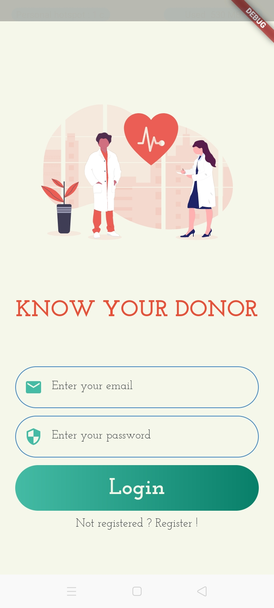
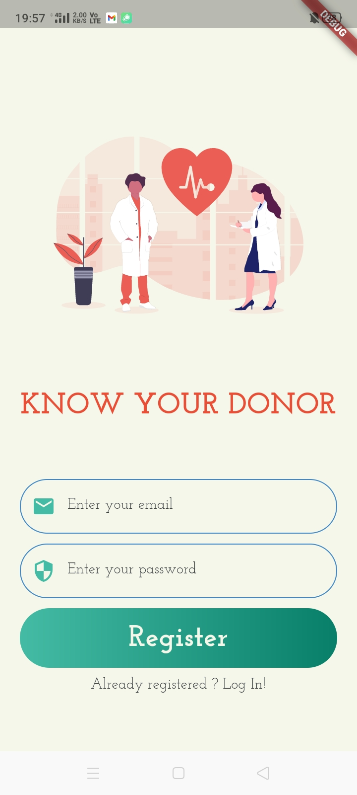
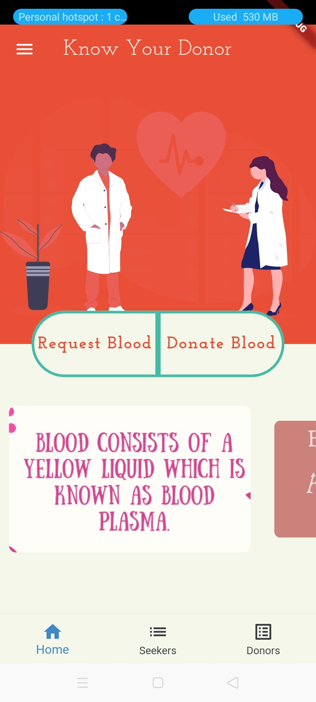
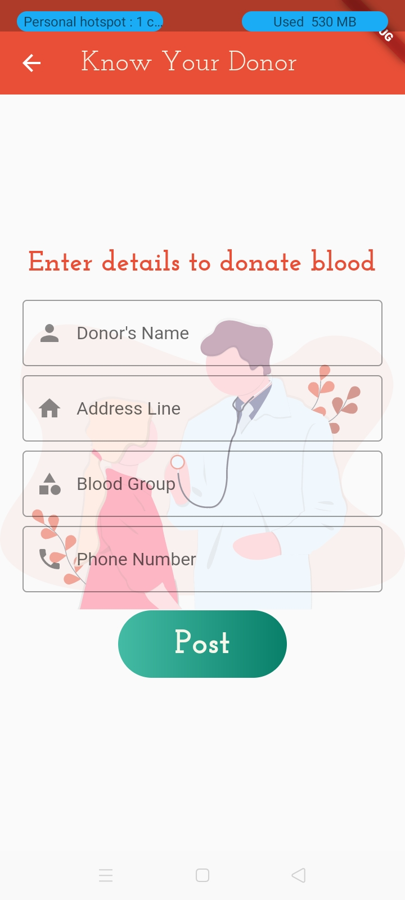
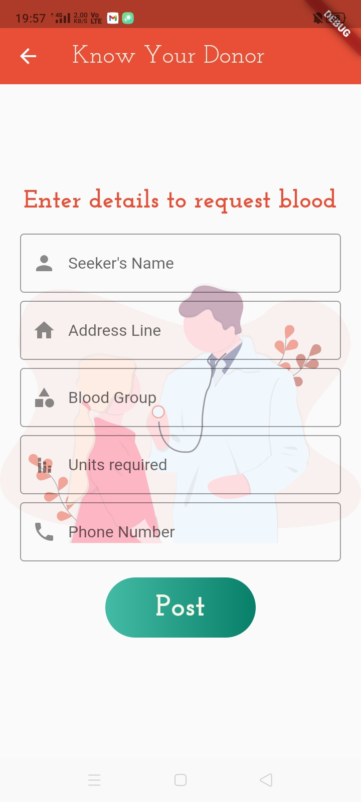
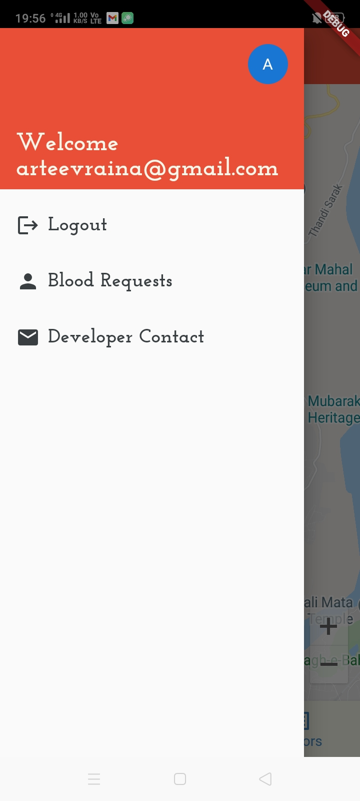

[](https://forthebadge.com)
[](https://forthebadge.com)
[](https://forthebadge.com)

<p>
  
  
  
  
  
</p>


# Know Your Donor 🩸

Blood Donation app made for connecting donor with the patient. During this harsh times of pandemic, normal health care services are facing a set back and Covid-19 is on the top of the priority of health care departments. Also, people are now afraid to leave visit hospitals to arrange blood as they fear they might catch Covid-19. So, to make their life easier Know Your Donor has been developed.

## Tech Stack 💻

- Flutter.
- Dart.
- Firebase.
- Provider for StateManagement.

## Features 🚀

- Email Authentication using Firebase.
- Find donors and recipients in your near by area.
- Volunteer as a Blood Donor or open a request for blood units.

Feel free to open an issue if you have something in mind, it might make a large impact 💓

## Screenshots 👀 

<p align="center">
  
  
  
  
  
  
  
  
  

## Getting Started ⭐

* Get an API key at <https://cloud.google.com/maps-platform/>.

* Enable Google Map SDK for each platform.
  * Go to [Google Developers Console](https://console.cloud.google.com/).
  * Choose the project that you want to enable Google Maps on.
  * Select the navigation menu and then select "Google Maps".
  * Select "APIs" under the Google Maps menu.
  * To enable Google Maps for Android, select "Maps SDK for Android" in the "Additional APIs" section, then select "ENABLE".
  * To enable Google Maps for iOS, select "Maps SDK for iOS" in the "Additional APIs" section, then select "ENABLE".
  * Make sure the APIs you enabled are under the "Enabled APIs" section.

* You can also find detailed steps to get start with Google Maps Platform [here](https://developers.google.com/maps/gmp-get-started).

### Web

```html
<body>
  <script src="https://maps.googleapis.com/maps/api/js?key=API_KEY"></script>
  <script src="main.dart.js" type="application/javascript"></script>
</body>
```

### Android

Specify your API key in the application manifest `android/app/src/main/AndroidManifest.xml`:

```xml
<manifest ...
  <application ...
    <meta-data android:name="com.google.android.geo.API_KEY"
               android:value="YOUR KEY HERE"/>
```

### iOS

Specify your API key in the application delegate `ios/Runner/AppDelegate.m`:

```objectivec
#include "AppDelegate.h"
#include "GeneratedPluginRegistrant.h"
#import "GoogleMaps/GoogleMaps.h"

@implementation AppDelegate

- (BOOL)application:(UIApplication *)application
    didFinishLaunchingWithOptions:(NSDictionary *)launchOptions {
  [GMSServices provideAPIKey:@"YOUR KEY HERE"];
  [GeneratedPluginRegistrant registerWithRegistry:self];
  return [super application:application didFinishLaunchingWithOptions:launchOptions];
}
@end
```

Or in your swift code, specify your API key in the application delegate `ios/Runner/AppDelegate.swift`:

```swift
import UIKit
import Flutter
import GoogleMaps

@UIApplicationMain
@objc class AppDelegate: FlutterAppDelegate {
  override func application(
    _ application: UIApplication,
    didFinishLaunchingWithOptions launchOptions: [UIApplication.LaunchOptionsKey: Any]?
  ) -> Bool {
    GMSServices.provideAPIKey("YOUR KEY HERE")
    GeneratedPluginRegistrant.register(with: self)
    return super.application(application, didFinishLaunchingWithOptions: launchOptions)
  }
}
```
Opt-in to the embedded views preview by adding a boolean property to the app's `Info.plist` file
with the key `io.flutter.embedded_views_preview` and the value `YES`.

## How to setup locally ? 🏁

1. Fork the repository.

2. Clone the repository using the following command.
  ```
  git clone https://github.com/<your-user-name>/KnowYourDonor.git
  ```

3. Open the code in your favorite code editor.

4. Install the dependencies using the following command:

```
$ flutter pub get
```

5. Build the app using the following command:

```
$ flutter run
```

## Repository Structure 🚧
```
 * lib/ : all the code which is making the app run goes in this directory.
 * lib/components : contains code for reusable widgets in the app like buttons, appbars, textboxes etc.
 * lib/constants : contains the configuration for color pallets, validator functions and text styles.
 * lib/models : contains code for Seeker and Donor Model.
 * lib/provider : contains code for all the Provider classes for statemanagement.
 * lib/repository : contains code for Donor and Seeker Repository for communicating with Cloud Firestore database.
 * lib/views : contains code for the frontend screens.
 * test : contains the code for widget and unit test of the Application.
 ```

## Interested in contributing ? 🌼

See the [contributor's guide!](CONTRIBUTING.md)

## Questions or issues ? 

If you have general question about the project. Feel free to join [discord server](https://discord.gg/8CsHncucds).

### Learn Flutter ?

Follow this [link](https://flutter.dev/)
